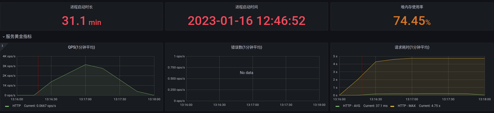

# Homework 3, JVM 虚拟机实践

## Q: 模拟服务高负载场景并观察JVM内部变化

### 环境设置
| Instance | Description          | Env                                |
|----------|----------------------|------------------------------------|
| hero1    | JMeter client        | Java1.8,JMeter                     |
| hero2    | MySQL storage system | Docker, mysql 5.7                  |
| hero3    | Java Application     | Java1.8, hero_web with Micrometer  |
| hero4    | Monitoring           | Docker,influxDB,Grafana,Prometheus |

1. 为了高效模拟JVM负载情况，使用内网压力机来排除网络带宽限制。
2. 实验分别按照三种GC模式，两种接口形式来执行，总共产生6种实验结果。

### 实验汇总

* 压力机参数
  - Threads: 1000, 2000, 3000
  - loop: 100
* 时间区间  

| GC           | low-latency   | high-latency  |
|--------------|---------------|---------------|
| 吞吐量优先   | 12:25 ~ 12:27 | 12:05 ~ 12:14 |
| 响应时间优先 | 12:42 ~ 12:45 | 12:30 ~ 12:38 |
| G1           | 13:16 ~ 13:17 | 12:47 ~ 12:53 |

### 分析

#### 吞吐量优先

问题：
1. Old generation分配不够多，频繁触发full gc
2. Meta space没有指定最大值，频繁扩容，间接引发full gc.

##### low-latency + 吞吐量
**RT + TPS**

**JVM info**

**GC**

##### high-latency + 吞吐量

**RT + TPS**

**JVM memory info**

**GC**

#### 响应时间优先
问题：
1. Old generation不足以及Metaspace扩容，频繁引起Full GC。
2. 相对于Throughput优先，GC平均freeze的时间较短，间接提高了throughput
3. 从图上来看，在单个GC的清理效率不及throughput优先的方法。

##### low-latency + 响应时间

**RT + TPS**

**JVM**

**GC**

##### high-latency + 响应时间

**RT + TPS**

**JVM**

**GC**

#### G1

1. 非常高效的内存利用策略，几乎解决了以上的所有问题（老年代不足，metaspace扩容）。
2. 高延迟场景下, GC效率不及低延时场景。

##### low-latency + G1

**RT + TPS**

**JVM**

**GC**

##### high-latency + G1 #####

**RT + TPS**

**JVM**

**GC**

